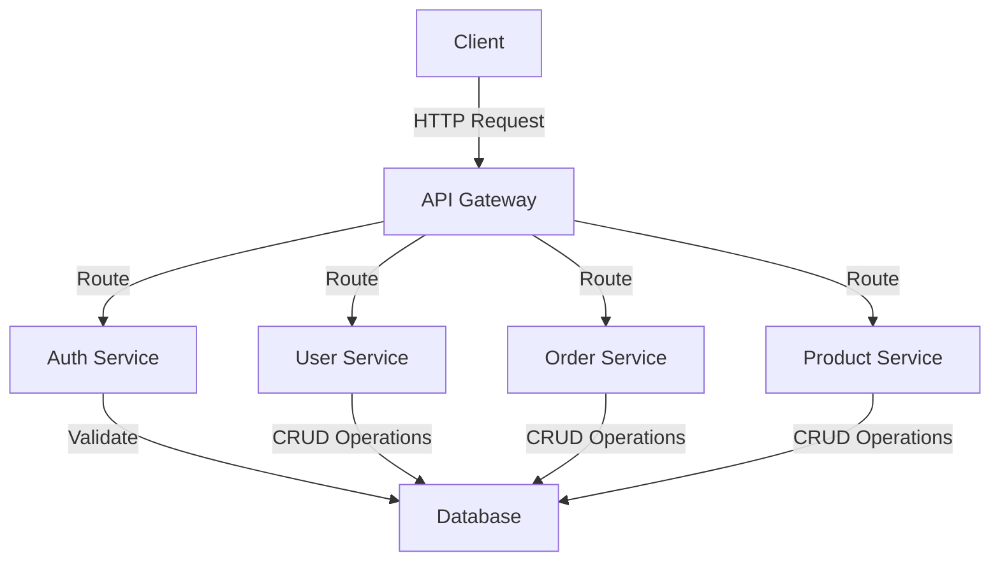

```markdown

```mermaid
graph TD
    A[Client] -->|HTTP Request| B[API Gateway]
    B -->|Route| C[Auth Service]
    B -->|Route| D[User Service]
    B -->|Route| E[Order Service]
    B -->|Route| F[Product Service]
    C -->|Validate| G[Database]
    D -->|CRUD Operations| G
    E -->|CRUD Operations| G
    F -->|CRUD Operations| G
```
```
